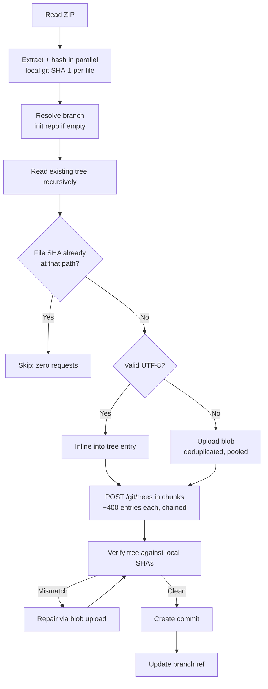

# GitHub ZIP Deployer

[](app.py)
[](app.go)
[](app.cpp)
[](app.erl)
[](app.rb)
[](index.php)
[](app.lua)
[](app.io)
[](app.reb)
[](app.hs)
[](app.fs)

Extract a ZIP archive and push its contents straight to a GitHub repository through
the GitHub API — no clone, no git binary, one commit.

**3,000 files deploy in about 75 seconds using ~210 API requests.**

## Why it is fast

The obvious way to do this is one `POST /git/blobs` request per file. That design has a
ceiling it cannot cross, and it is not bandwidth or concurrency:

> GitHub's secondary rate limit allows **900 points per minute**, and **every POST costs
> 5 points** — a hard cap of **180 POSTs per minute**.
> ([rate limit docs](https://docs.github.com/en/rest/using-the-rest-api/rate-limits-for-the-rest-api))

One request per file therefore needs **at least 16.7 minutes for 3,000 files**, no matter
how many threads you throw at it. Adding concurrency just makes you hit `403 secondary
rate limit` sooner.

The fast path avoids the per-file request entirely:

| Technique | Effect |
|---|---|
| **Inline content in tree entries** — the [tree API](https://docs.github.com/en/rest/git/trees#create-a-tree) accepts `content` per entry and writes the blob for you | ~3,000 POSTs collapse into ~10 |
| **Local git SHA-1 diffing** — the SHA git would assign is computed locally and compared with the branch's tree | Unchanged files cost zero requests |
| **Content deduplication** — identical bytes upload once; blobs already in the repo are referenced by SHA | Repeated assets are free |
| **Streaming worker pool** for the binary files that genuinely need blobs | No batch barriers waiting on the slowest file |
| **Proactive rate-limit pacing** against the documented point budget, plus retry with backoff honouring `Retry-After` | Never trips the limit; survives 5xx and network blips |
| **Parallel ZIP decompression** and connection reuse | Extraction and hashing overlap with I/O |

Only text files can ride inline (the API's `content` field is a JSON string), so binaries
still take the blob route — which is why the request count scales with the number of
*binary* files, not the total.

## Measured results

From `tests/benchmark.py`, which runs both implementations against a mock GitHub API that
simulates realistic latency **and enforces the real 900-points/minute secondary limit**.
The "original" rows run the pre-optimisation `app.py` verbatim, pulled out of git history.

```
scenario                                  files       time   requests     ok
------------------------------------------------------------------------------
New engine, first deploy                   3000      72.7s        210    yes
New engine, no-op redeploy                 3000       2.0s          3    yes
New engine, 1 file changed                 3000       4.4s          7    yes
Original, rate limit OFF (400 files)        400      13.9s        407    yes
Original, projected to 3000 (no limit)     3000    1.7 min       3005      -
Original, floor imposed by rate limit      3000   16.7 min       3005      -
Original, rate limit ON (400 files)         400       5.9s        184     NO
```

Two things worth reading twice:

* The original implementation **fails outright** once the real rate limit is enforced —
  it has no retry logic, so the first `403` aborts the deploy mid-way, leaving the branch
  untouched and the work wasted.
* The new engine's 3,000-file deploy was verified **byte for byte** (3000/3000) against
  locally computed git SHAs after the upload.

### TypeScript / Astro projects

Source-heavy repositories are the best case, because almost everything is text and
therefore inlines. Benchmarked with `--profile astro`, whose fixture is generated to match
a real Astro site's language breakdown (TypeScript 92.2%, CSS 4.9%, Astro 2.3%, other
0.6%) and includes an oversized generated `.ts` bundle plus binary assets under `public/`:

```
scenario                                  files       time   requests     ok
------------------------------------------------------------------------------
New engine, first deploy                   3003      12.1s         32    yes
New engine, no-op redeploy                 3003       2.0s          3    yes
New engine, 1 file changed                 3003       4.5s          7    yes
Original, rate limit ON (400 files)         400       6.0s        184     NO
```

**3,003 files in 12 seconds using 32 requests**, all verified byte-exact — only 16 files
(the binary assets and the >1 MB bundle) needed a blob upload; the other 2,987 rode inline.

Run it yourself:

```bash
python3 tests/benchmark.py --profile astro --files 3000
```

#### A unicode gotcha this shook out

Python's `json.dumps` escapes non-ASCII by default, expanding every CJK character or emoji
into a 6-byte `\uXXXX` sequence, and the chunker was sizing payloads by *character* count
while UTF-8 spends 3–4 bytes on those same characters. On a Japanese or emoji-heavy repo
both errors compound. Measured on 3.1 MB of CJK content:

| | largest request body |
|---|---|
| before | 6.84 MB |
| after (UTF-8 body, byte-accurate sizing) | **2.79 MB** |

Both the Python and browser versions now send compact UTF-8 and budget chunks by the
real JSON byte length. If GitHub still rejects a tree POST as too large, the chunk is
split and retried so the send finishes instead of crashing. `tests/test_deploy.py` and
`tests/test_browser.mjs` assert the bound.

Numbers are latency-simulated rather than measured against github.com; what they capture
is the shape of the work — how many round trips, and whether the rate limit is tripped —
which is what governs real-world wall time.

## Optimised implementations

| Implementation | Status |
|---|---|
| [`app.py`](app.py) (Python) | Fast engine — inline trees, SHA diffing, retries, verification |
| [`index.html`](index.html) (browser) | Fast engine — same algorithm in the browser |
| The other 9 language ports | Still the original one-blob-per-file approach; fine for small archives, subject to the 16.7-minute floor for large ones |

Porting the fast engine to the remaining languages is a good contribution — the Python
version is the reference implementation, and `tests/mock_github.py` will validate any port.

## Quick start

### Browser

Open [`index.html`](index.html) — no install, no server. Paste a token, pick a repo, drop
a ZIP. The token stays in the page and is never stored or transmitted anywhere except
api.github.com.

### Python

```bash
python app.py                                   # interactive prompts
```

Or non-interactively, which is what you want in CI:

```bash
export GITHUB_TOKEN=ghp_...
python app.py --owner octocat --repo hello-world --zip ./site.zip
```

No third-party packages are required. `requests` is used automatically for connection
pooling when it happens to be installed; otherwise the standard library handles it.

#### Options

| Flag | Purpose |
|---|---|
| `--owner`, `--repo`, `--branch`, `--zip` | Target and source (prompted if omitted) |
| `--token` | Token; prefer `$GITHUB_TOKEN` so it stays out of shell history |
| `--message`, `-m` | Commit message |
| `--strip-root` | Drop the single wrapper folder many ZIPs add |
| `--prune` | Delete repository files absent from the ZIP (mirror the archive) |
| `--dry-run` | Analyse the archive and estimate requests without writing |
| `--json` | Machine-readable summary on stdout |
| `--workers` | Parallel connections for blob uploads (default 12) |
| `--no-inline` | Disable inline tree content — the old slow path, for debugging |
| `--no-verify` | Skip the post-upload verification read |
| `--api-base` | Point at GitHub Enterprise or a test server |
| `--quiet`, `-q` | Only warnings and errors |

Example output:

```
$ python app.py --owner octocat --repo hello-world --zip site.zip

GitHub ZIP Deployer — fast edition

[14:32:15] - Reading site.zip (12.4 MB)...
[14:32:16] - Extracted and hashed 3000 file(s), 41.2 MB in 0.71s
[14:32:16] - Target: octocat/hello-world on branch 'main'
[14:32:16] - Resolving branch 'main'...
[14:32:17] - Reading existing tree to skip unchanged files...
[14:32:17] - Plan: 2806 inlined into tree, 194 uploaded as blobs, 0 reused, 0 unchanged.
[14:32:18] - Uploading 194 binary/large file(s) as blobs on 12 connections...
[14:32:44] -   -> 194/194 blobs (7.4/s)
[14:32:44] - Writing 3000 tree entries in 8 request(s)...
[14:33:22] - Verifying tree contents against locally computed SHAs...
[14:33:28] + Verification passed — every file matches byte for byte.
[14:33:29] + Deployed 3000 file(s) in 72.7s (41 files/s) using 210 API requests.
```

## How it works



1. **Read and hash.** Members are decompressed across a thread pool. `__MACOSX`,
   `.DS_Store`, `Thumbs.db`, `.git/` and any `..` traversal are dropped. The executable
   bit is preserved. Each file gets the SHA-1 git itself would assign.
2. **Diff.** The branch tree is read once; files whose path and SHA already match are
   skipped entirely.
3. **Split.** TypeScript, CSS, Astro and other valid UTF-8 ride inline — even a
   generated file of a couple of MB. Only real binaries take the blob route.
4. **Write.** Trees are written in chunks bounded by entry count and payload size, each
   chained onto the previous via `base_tree`.
5. **Verify.** The resulting tree is read back and compared against the locally computed
   SHAs. Any mismatch is repaired with a real blob upload before the commit is created.
6. **Commit** and update the branch ref — a single commit, so the branch is never left in
   a half-deployed state.

## Testing

```bash
./tests/run_all.sh            # everything, quick benchmark
./tests/run_all.sh --full     # everything, full 3000-file benchmark
```

Individually:

```bash
python3 tests/test_deploy.py               # Python correctness (26 tests)
node tests/test_browser.mjs                # browser end-to-end (needs: npm i --no-save jszip)
python3 tests/benchmark.py                 # head-to-head benchmark (generic web project)
python3 tests/benchmark.py --profile astro # benchmark an Astro/TypeScript corpus
python3 tests/mock_github.py               # run the mock API standalone on :8080
```

[`tests/mock_github.py`](tests/mock_github.py) is a deliberately strict stand-in for
GitHub's Git Data API:

* blob SHAs are **real git SHA-1s**, so any corruption of content — encoding, newlines,
  truncation — changes the SHA and fails the test;
* tree entries must supply exactly one of `sha` or `content`, and an unknown `sha` is
  rejected with 422, as the real API does;
* the 900-points/minute secondary limit is enforced, with `403` + `Retry-After`;
* latency is simulated, including a per-entry cost for large tree writes, so a request
  carrying 400 files is not pretended to be free;
* faults can be injected (every Nth request returns a transient 500) to exercise retries.

The browser tests run the script **extracted from `index.html` itself** in a Node VM with
a stubbed DOM and `fetch` aimed at the mock, so the shipped code is what gets tested.

Coverage includes byte-exact round trips for unicode, CRLF, empty files, files containing
NUL bytes, binaries and executables; incremental redeploys; deduplication; pruning; path
filtering; empty-repository bootstrap; flaky-API retries; request-payload bounds on
CJK-heavy content; text files above the inline threshold; and the SHA-1 fallback used when
`crypto.subtle` is unavailable.

The optional benchmark dependencies (`requests`, `colorama` for running the original
implementation, `jszip` for the browser tests) are skipped with a clear message when
absent — the deployer itself needs none of them.

## Other language versions

| Language | File | Dependencies | Run Command |
|----------|------|--------------|--------------|
| Python | app.py | none (optional: requests, colorama) | `python app.py` |
| Go | app.go | (none, uses stdlib) | `go run app.go` |
| C++ | app.cpp | libcurl, libzip, nlohmann/json | `g++ -o app app.cpp -lcurl -lzip && ./app` |
| Erlang | app.erl | jsx, ibrowse (or httpc) | `escript app.erl` |
| Ruby | app.rb | rubyzip, json | `ruby app.rb` |
| PHP | index.php | zip, curl (extensions) | `php index.php` |
| Lua | app.lua | luasocket, lua-zip, json-lua | `lua app.lua` |
| Io | app.io | Io with the Zip addon | `io app.io` |
| Rebol | app.reb | Rebol 2 or 3 with Base64 | `rebol app.reb` |
| Haskell | app.hs | stack with aeson, zip-archive, http-conduit | `stack app.hs` |
| Forth | app.fs | Gforth, curl, jq, unzip | `gforth app.fs` |

These still use the original one-request-per-file algorithm. They work well for small
archives; for large ones, use the Python or browser version.

## Prerequisites

- A GitHub account.
- A personal access token with the `repo` scope
  ([create one](https://docs.github.com/en/authentication/keeping-your-account-and-data-secure/managing-your-personal-access-tokens)).
- Python 3.8+ for `app.py`, or any modern browser for `index.html`.

## Troubleshooting

* **Authentication failed** — check the token has `repo` scope and the owner/repo names
  are right. Fine-grained tokens need "Contents: write" on the target repository.
* **Secondary rate limit** — the Python and browser versions pace themselves under the
  budget and back off automatically; you should not see this. If you do, lower
  `--workers` or `--points-per-min`.
* **Branch not found / empty repository** — handled automatically: an initial commit with
  a `README.md` is created, then the deploy proceeds.
* **A file is over 100 MB** — GitHub's blob API rejects it. The deploy stops before
  writing anything and names the offending files. Use Git LFS for those.
* **Large archives** — the tools hold the archive and its extracted contents in memory.
  Budget roughly 2–3x the uncompressed size.
* **Verification failed** — the deploy aborts *before* creating the commit, so the branch
  is untouched. Please open an issue with the reported paths.

## Contributing

Contributions are welcome. Good next steps:

* Port the fast engine to the remaining languages (`tests/mock_github.py` validates ports).
* Resumable deploys for very large archives.
* A GitHub Action wrapper.

## License

This project is licensed under the MIT License. See [LICENSE.md](LICENSE.md).

> **Disclaimer** — provided "as is", without warranty of any kind. Use at your own risk,
> and keep backups before bulk operations. `--prune` deletes files.
