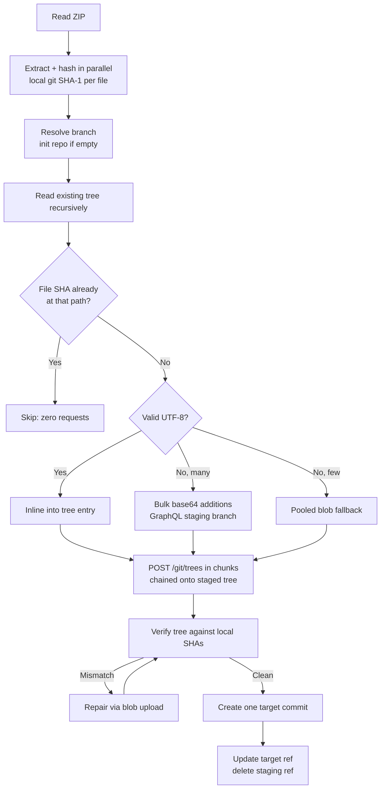

# Zip to git

**Drop a ZIP, get a commit.** Zip to git extracts a ZIP archive and pushes its contents
straight to a GitHub repository through the GitHub API — no clone, no git binary, one
atomic commit.

[](app.py)
[](index.html)
[](app.go)
[](app.cpp)
[](app.erl)
[](app.rb)
[](index.php)
[](app.lua)
[](app.hs)
[](LICENSE.md)

> **4,200 files deployed in 18.2 seconds using 26 API requests** — measured against a
> latency-simulating mock GitHub API with the real 900-points/minute secondary rate
> limit enforced, and verified byte-for-byte. A naive one-request-per-file uploader
> needs a mathematical minimum of **23 minutes** for the same archive.

---

## Highlights

* ⚡ **Thousands of files in seconds, not minutes.** Text rides inline inside tree
  requests; binaries are batched 100-at-a-time through GraphQL. A 4,000-file site
  costs ~25 API calls instead of ~4,000.
* 📊 **Real-time progress bar.** Phase, percentage, files done, elapsed time, a live
  API-request counter, and an ETA — in the terminal and in the browser.
* 📝 **Live request log.** Every API round trip can be streamed as
  `req #12 POST /git/trees -> 201 in 1094 ms | 194.3 KB sent` (`--log-requests` / `-v`
  in the CLI, a checkbox in the browser).
* 🔁 **Incremental.** Local git SHA-1 diffing means unchanged files cost zero requests;
  a no-op redeploy finishes in ~2 seconds with 3 API calls.
* ✅ **Verified.** After writing, the tree is read back and compared against locally
  computed git SHAs; mismatches are repaired before the commit is created. The target
  branch receives exactly one commit and is never left half-deployed.
* 🛡️ **Rate-limit aware.** Proactive pacing under GitHub's 900-points/minute secondary
  limit, with retry, backoff, and `Retry-After` support.
* 🧳 **Zero dependencies.** The Python CLI runs on the standard library; the browser
  version is a single HTML file.

## Quick start

### Browser

Open [`index.html`](index.html) — no install, no server. Paste a token, pick a repo,
drop a ZIP, watch the live progress bar and request log. The token stays in the page
and is never sent anywhere except `api.github.com`.

### Command line

```bash
python app.py                     # interactive prompts
```

Non-interactively (what you want in CI):

```bash
export GITHUB_TOKEN=ghp_...
python app.py --owner octocat --repo hello-world --zip ./site.zip --log-requests
```

No third-party packages are required. `requests` is used automatically for connection
pooling when it happens to be installed; otherwise the standard library handles it.

### What it looks like

```
$ python app.py --owner demo --repo bigsite --zip bigsite.zip --log-requests

Zip to git — fast edition

[14:26:44] - Reading bigsite.zip (1.5 MB)...
[14:26:44] - Extracted and hashed 4200 file(s), 3.4 MB in 0.35s
[14:26:44] - Plan: 3800 inlined into tree, 400 uploaded as blobs, 0 reused, 0 unchanged.
[14:26:45] > req #7   POST   /graphql -> 200 in 496 ms | 271.2 KB sent
[14:26:46] > req #8   POST   /graphql -> 200 in 489 ms | 273.0 KB sent
[14:26:47] - Bulk-staged 400 blob(s) in 4 request(s).
[14:26:48] > req #12  POST   /git/trees -> 201 in 1094 ms | 194.3 KB sent
[##################--------]  70.0% Writing git tree | 11.1s | 2400/4200 tree entries | 18 req | ETA 5s
[14:27:01] + Verification passed — every file matches byte for byte.
[##########################] 100.0% Deployed | 18.2s | 26 req
[14:27:02] + Deployed 4200 file(s) in 18.2s (230 files/s) using 26 API requests.
[14:27:02] - https://github.com/demo/bigsite/tree/main
```

The bar renders on one terminal line (TTY only; `--no-progress` disables it) and stays
pinned below the log, so both are readable at once.

## Why it is fast

The obvious design — one `POST /git/blobs` per file — has a ceiling that no amount of
threads can cross:

> GitHub's secondary rate limit allows **900 points per minute**, and **every POST costs
> 5 points** — a hard cap of **180 POSTs per minute**.
> ([rate limit docs](https://docs.github.com/en/rest/using-the-rest-api/rate-limits-for-the-rest-api))

One request per file therefore needs **at least 16.7 minutes for 3,000 files**. Adding
concurrency just makes you hit `403 secondary rate limit` sooner.

Zip to git avoids the per-file request entirely:

| Technique | Effect |
|---|---|
| **Inline text in tree entries** — the [tree API](https://docs.github.com/en/rest/git/trees#create-a-tree) accepts `content` per entry and writes the blob | Thousands of source files collapse into a few POSTs |
| **Bulk binary mutations** — GraphQL [`createCommitOnBranch`](https://docs.github.com/en/graphql/reference/mutations#createcommitonbranch) accepts RFC 4648 base64, including binary bytes | Up to 100 binary files ride in each mutation |
| **Disposable staging branch** — bulk mutations write to a random temporary branch; its tree is folded into the final REST commit and the ref is deleted | The target branch still receives exactly one commit |
| **Local git SHA-1 diffing** — the SHA git would assign is computed locally and compared with the branch's tree | Unchanged files cost zero requests |
| **Content deduplication** — identical bytes upload once; blobs already in the repo are referenced by SHA | Repeated assets are free |
| **Pooled fallback uploads** — small binary sets and GraphQL-incompatible servers use parallel blob writes | Fast for small sends; compatibility is retained |
| **Proactive rate-limit pacing** with retry/backoff and `Retry-After` support | Avoids secondary-limit stalls and survives transient failures |
| **Parallel ZIP decompression** and connection reuse | Extraction and hashing overlap with I/O |
| **Byte-accurate payload packing** — chunks are sized by real UTF-8 JSON bytes, not character counts | CJK/emoji-heavy repos don't blow the request budget; oversized chunks split and retry instead of crashing |

## Benchmarks

From [`tests/benchmark.py`](tests/benchmark.py), which runs against a mock GitHub API
that simulates realistic latency **and enforces the real 900-points/minute secondary
limit**. The "original" rows run the pre-optimisation implementation verbatim, pulled
out of git history.

```
scenario                                  files       time   requests     ok
------------------------------------------------------------------------------
Mixed web project, first deploy             3000      13.5s         21    yes
All-binary project, first deploy            3000      27.7s         49    yes
All-binary, no-op redeploy                  3000       1.9s          3    yes
All-binary, 1 file changed                  3000       4.7s          8    yes
Original, rate limit OFF (400 files)         400      13.9s        407    yes
Original, projected to 3000 (no limit)      3000    1.7 min       3005      -
Original, floor imposed by rate limit       3000   16.7 min       3005      -
Original, rate limit ON (400 files)          400       5.9s        184     NO
```

Two things worth reading twice:

* The original implementation **fails outright** once the real rate limit is enforced —
  it has no retry logic, so the first `403` aborts the deploy mid-way.
* The fast engine's deploys were verified **byte for byte** against locally computed
  git SHAs, with zero per-file `POST /git/blobs` calls and zero rate-limit rejections.

A TypeScript/Astro-shaped corpus (92% TS, generated oversized bundle, binary assets
under `public/`) behaves even better, because almost everything inlines:

```
scenario                                  files       time   requests     ok
------------------------------------------------------------------------------
New engine, first deploy                   3004      12.6s         20    yes
New engine, no-op redeploy                 3004       1.9s          3    yes
New engine, 1 file changed                 3004       4.5s          7    yes
```

Run them yourself:

```bash
python3 tests/benchmark.py --profile generic --files 4000 --skip-legacy
python3 tests/benchmark.py --profile astro  --files 3000
python3 tests/benchmark.py --profile binary --files 3000 --skip-legacy
```

Numbers are latency-simulated rather than measured against github.com; what they capture
is the shape of the work — how many round trips, and whether the rate limit is tripped —
which is what governs real-world wall time.

## CLI options

| Flag | Purpose |
|---|---|
| `--owner`, `--repo`, `--branch`, `--zip` | Target and source (prompted if omitted) |
| `--token` | Token; prefer `$GITHUB_TOKEN` so it stays out of shell history |
| `--message`, `-m` | Commit message |
| `--log-requests`, `-v` | Stream every API request (method, path, status, latency, payload size) |
| `--no-progress` | Disable the live progress bar (auto-disabled when not a TTY) |
| `--strip-root` | Drop the single wrapper folder many ZIPs add |
| `--prune` | Delete repository files absent from the ZIP (mirror the archive) |
| `--dry-run` | Analyse the archive and estimate requests without writing |
| `--json` | Machine-readable summary on stdout |
| `--workers` | Parallel connections for extraction and fallback blob uploads (default 12) |
| `--no-inline` | Disable inline tree content |
| `--no-bulk` | Disable batched GraphQL binary writes and use per-blob fallback uploads |
| `--no-verify` | Skip the post-upload verification read |
| `--api-base`, `--graphql-base` | Point at GitHub Enterprise or a test server |
| `--points-per-min` | Secondary rate-limit budget to stay under (default 900) |
| `--quiet`, `-q` | Only warnings and errors |

## How it works



1. **Read and hash.** Members are decompressed across a thread pool. `__MACOSX`,
   `.DS_Store`, `Thumbs.db`, `.git/` and any `..` traversal are dropped. The executable
   bit is preserved. Each file gets the SHA-1 git itself would assign.
2. **Diff.** The branch tree is read once; files whose path and SHA already match are
   skipped entirely.
3. **Split.** TypeScript, CSS, Astro and other valid UTF-8 ride inline — even a
   generated file of a couple of MB. Binary/oversized files are deduplicated by SHA.
4. **Bulk binary write.** Eight or more new binary blobs are base64-packed into bounded
   GraphQL batches (up to 100 files each) on a random temporary branch. Smaller sets use
   the pooled REST fallback. If GraphQL is unavailable, the fallback is automatic.
5. **Write.** Inline text, binary SHA references, deletions, and executable-mode fixes
   are written in bounded tree chunks chained onto the staged binary tree.
6. **Verify.** The resulting tree is read back and compared against locally computed
   SHAs. Any mismatch is repaired before the target commit is created.
7. **Commit** and update the target ref once, then delete the staging ref. The target
   branch receives one atomic commit and is never left half-deployed.

Throughout, a progress callback reports each phase (weighted by cost) to the live bar,
and an observer hook on the HTTP client feeds the request counter and request log —
telemetry can never break a deploy.

## Implementations

| Implementation | Status |
|---|---|
| [`app.py`](app.py) (Python) | **Fast engine** — inline text, batched binary GraphQL, SHA diffing, verification, live progress + request log |
| [`index.html`](index.html) (browser) | **Fast engine** — same binary-safe algorithm, live progress bar and request log in the page |
| [`app.go`](app.go), [`app.cpp`](app.cpp), [`app.erl`](app.erl), [`app.rb`](app.rb), [`index.php`](index.php), [`app.lua`](app.lua), [`app.io`](app.io), [`app.reb`](app.reb), [`app.hs`](app.hs), [`app.fs`](app.fs) | Original one-blob-per-file approach; fine for small archives, subject to the 16.7-minute floor for large ones |

| Language | File | Dependencies | Run |
|----------|------|--------------|-----|
| Python | app.py | none (optional: requests, colorama) | `python app.py` |
| Go | app.go | stdlib only | `go run app.go` |
| C++ | app.cpp | libcurl, libzip, nlohmann/json | `g++ -o app app.cpp -lcurl -lzip && ./app` |
| Erlang | app.erl | jsx, ibrowse (or httpc) | `escript app.erl` |
| Ruby | app.rb | rubyzip, json | `ruby app.rb` |
| PHP | index.php | zip, curl (extensions) | `php index.php` |
| Lua | app.lua | luasocket, lua-zip, json-lua | `lua app.lua` |
| Io | app.io | Io with the Zip addon | `io app.io` |
| Rebol | app.reb | Rebol 2 or 3 with Base64 | `rebol app.reb` |
| Haskell | app.hs | stack with aeson, zip-archive, http-conduit | `stack app.hs` |
| Forth | app.fs | Gforth, curl, jq, unzip | `gforth app.fs` |

Porting the fast engine to the remaining languages is a good contribution — the Python
version is the reference implementation, and `tests/mock_github.py` validates any port.

## Testing

```bash
./tests/run_all.sh            # everything, quick benchmark
./tests/run_all.sh --full     # everything, full 3000-file benchmark
```

Individually:

```bash
python3 tests/test_deploy.py                # Python correctness (35 tests)
node tests/test_browser.mjs                 # browser end-to-end (needs: npm i --no-save jszip)
python3 tests/benchmark.py                  # head-to-head benchmark (generic web project)
python3 tests/mock_github.py                # run the mock API standalone on :8080
```

[`tests/mock_github.py`](tests/mock_github.py) is a deliberately strict stand-in for
GitHub's Git Data API:

* blob SHAs are **real git SHA-1s**, so any corruption of content — encoding, newlines,
  truncation — changes the SHA and fails the test;
* tree entries must supply exactly one of `sha` or `content`, and an unknown `sha` is
  rejected with 422, as the real API does;
* the 900-points/minute secondary limit is enforced, with `403` + `Retry-After`;
* `createCommitOnBranch` is modeled with strict base64 decoding, binary bytes,
  expected-head checks, temporary refs, and real git blob SHAs;
* latency is simulated, including a per-entry cost for large tree and GraphQL writes;
* faults can be injected (every Nth request returns a transient 500) to exercise retries.

The browser tests run the script **extracted from `index.html` itself** in a Node VM
with a stubbed DOM and `fetch` aimed at the mock, so the shipped code is what gets
tested.

Coverage includes byte-exact round trips for unicode, CRLF, empty files, binaries and
executables; incremental redeploys; deduplication; pruning; path filtering;
empty-repository bootstrap; flaky-API retries; request-payload bounds on CJK-heavy
content; 3,000-file binary batching; adaptive payload splitting; temporary-ref cleanup;
progress/telemetry regressions; and the SHA-1 fallback used when `crypto.subtle` is
unavailable.

## Prerequisites

- A GitHub account.
- A personal access token with the `repo` scope
  ([create one](https://docs.github.com/en/authentication/keeping-your-account-and-data-secure/managing-your-personal-access-tokens)).
- Python 3.8+ for `app.py`, or any modern browser for `index.html`.

## Troubleshooting

* **Authentication failed** — check the token has `repo` scope and the owner/repo names
  are right. Fine-grained tokens need "Contents: write" on the target repository.
* **Secondary rate limit** — Zip to git paces itself under the budget and backs off
  automatically; you should not see this. If you do, lower `--workers` or
  `--points-per-min`.
* **Temporary staging branches / CI** — binary batching creates and removes refs named
  `zip-to-git/stage-*`. A workflow configured for pushes to every branch may observe
  those short-lived staging commits. Ignore that prefix in the workflow, or use
  `--no-bulk` / uncheck **Batch binary files** to use the slower per-blob fallback.
* **Branch rules reject staging refs** — Zip to git automatically falls back to pooled
  blob uploads. Allow the `zip-to-git/stage-*` prefix for full binary speed.
* **Branch not found / empty repository** — handled automatically: an initial commit
  with a `README.md` is created, then the deploy proceeds.
* **A file is over 100 MB** — GitHub's blob API rejects it. The deploy stops before
  writing anything and names the offending files. Use Git LFS for those.
* **Large archives** — the tools hold the archive and its extracted contents in memory.
  Budget roughly 2–3x the uncompressed size.
* **Verification failed** — the deploy aborts *before* creating the commit, so the
  branch is untouched. Please open an issue with the reported paths.

## Contributing

Contributions are welcome. Good next steps:

* Port the fast engine to the remaining languages (`tests/mock_github.py` validates ports).
* Resumable deploys for very large archives.
* A GitHub Action wrapper.

## License

This project is licensed under the MIT License. See [LICENSE.md](LICENSE.md).

> **Disclaimer** — provided "as is", without warranty of any kind. Use at your own risk,
> and keep backups before bulk operations. `--prune` deletes files.
